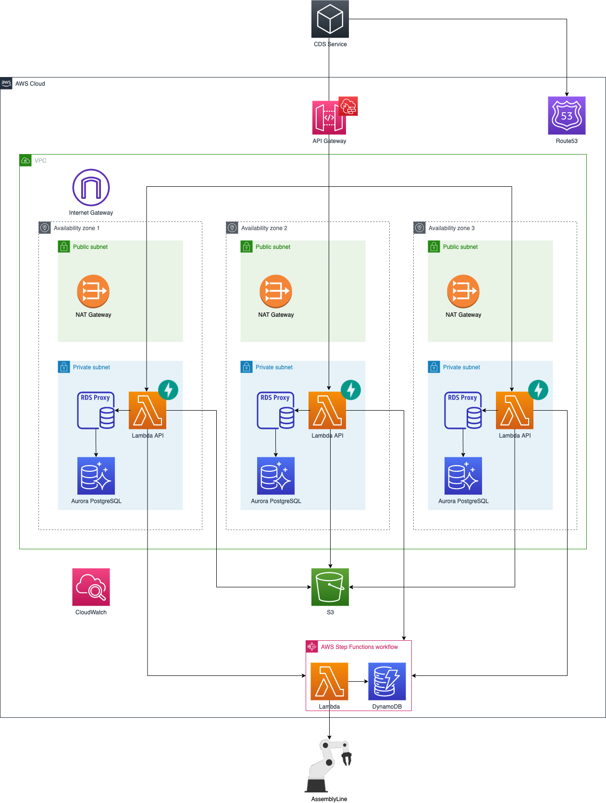

# Scan-files Infrastructure

1. Virtual Private Cloud (VPC) with three public and three private subnets.
1. API Gateway (AGW) to allow inbound/outbound communication, protected by Web Application Firewall (WAF), as main user request entry point and has an Lambda API as its target.
1. NAT Gateways (3) to allow private subnets to communicate with AGW.
1. Lambda API is serving requests to a FastAPI web framework in each private subnet (3 total).
1. Relational Database Service (RDS) PostgreSQL Cluster with a instance in each private subnet serves as database for the Lambda API.  
1. S3 to store file uploads
1. Lambda API communicates with a database through an RDS Proxy (performs connection pooling and management).
1. Lambda API stores objects using S3
1. Lambda API launches a Step Function that uses DynamoDB as a data store and a Lambda as a data processor.
1. Step Function Lambda communicates with AssemblyLine to submit and retrieve requests.
